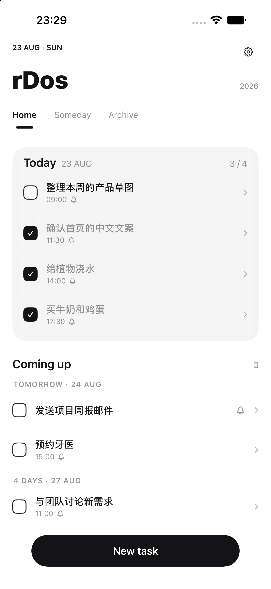
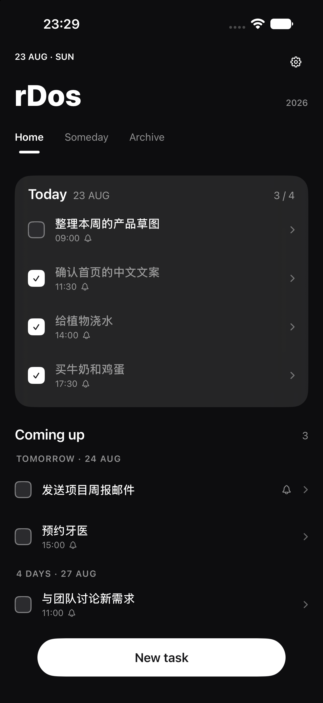

# rDos

一款极简黑白风格的 iOS 待办应用。SwiftUI + SwiftData 构建，使用 iOS 26 Liquid Glass 设计语言，支持桌面与锁屏小组件。




## 设计理念

本项目的核心灵感来自 [@daimajia](https://x.com/daimajia) 的这条[推文](https://x.com/daimajia/status/2091362554291577217)：

> 好多事，我并不想甚至也没有办法安排到底什么时候一定要完成。

很多事没法（也不想）安排一个确定的完成日期。因此 rDos 把任务分成两种：

- **有日期的任务** — 出现在 Home，按 Today / Coming up（Tomorrow、N DAYS…）分组
- **某天（Someday）** — 那些暂时没有明确期限的事，先记下来，哪天想做了再给它一个日期

感谢这个 idea 👏

## 功能

- **三标签页**：Home（按天分组）/ Someday（无日期任务）/ Archive（归档）
- **任务**：标题 + 正文（进入编辑时展示）、日期（今天/明天/自选/某天）、具体时间、到点提醒（本地通知）
- **手势**：
  - 右滑任务 → 标记完成
  - 左滑任务 → 归档 / 删除（划到底直接触发）
  - 点任务 → 直接编辑
- **归档**：手动归档 + 已完成任务次日自动归档，Archive 页右滑可恢复
- **每日开始时间**：可自定义"今天"从几点开始（默认凌晨 4 点），影响分组与归档时机
- **小组件**：桌面小/中/大 + 锁屏环形/矩形/内联，实时展示今日进度与即将到来的任务
- **外观**：浅色 / 深色 / 跟随系统
- **新手引导**：首次启动自动播放，设置里可重新查看
- 纯本地存储（SwiftData），无账号、无云端、无追踪

## 技术栈

- Swift 5 / SwiftUI / SwiftData
- iOS 26+（Liquid Glass、glassEffect、`ultraThinMaterial` 等）
- WidgetKit（小组件与主 App 通过 App Group 共享数据库）
- 本地通知（UserNotifications）
- 零第三方依赖

## 构建

```bash
# 模拟器
xcodebuild -project rDos.xcodeproj -scheme rDos \
  -destination 'platform=iOS Simulator,name=iPhone 17 Pro' build

# 真机（需要已配置的开发者签名）
xcodebuild -project rDos.xcodeproj -scheme rDos -configuration Release \
  -destination 'platform=iOS,id=<设备UDID>' -allowProvisioningUpdates build
```

或直接用 Xcode 打开 `rDos.xcodeproj`，选设备后 Cmd+R。

> Debug 构建首次启动会预置少量示例任务用于界面预览（设置 → 开发者选项可清除）；Release 构建不包含任何预置数据。

## 项目结构

```
rDos/
  rDosApp.swift          # 入口、容器、调试示例数据(#if DEBUG)
  TaskItem.swift         # SwiftData 模型 + App Group 共享
  AppSettings.swift      # 设置持久化(@Observable)
  DayGrouping.swift      # 每日开始时间感知的日期分组
  NotificationManager.swift
  Theme.swift            # 动态配色、按压反馈样式
  MainView.swift         # 主界面（header/标签/主按钮）
  HomeView.swift         # Today 卡片 + Coming up
  TaskRowView.swift      # 任务行（滑动操作/展开）
  TaskEditorView.swift   # 新建/编辑
  SomedayArchiveViews.swift
  SettingsView.swift
  Onboarding.swift       # 新手引导浮层
rDosWidgets/
  rDosWidgets.swift      # 桌面 + 锁屏小组件
```
